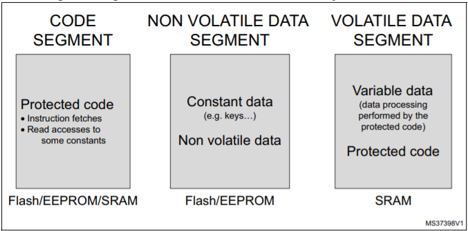
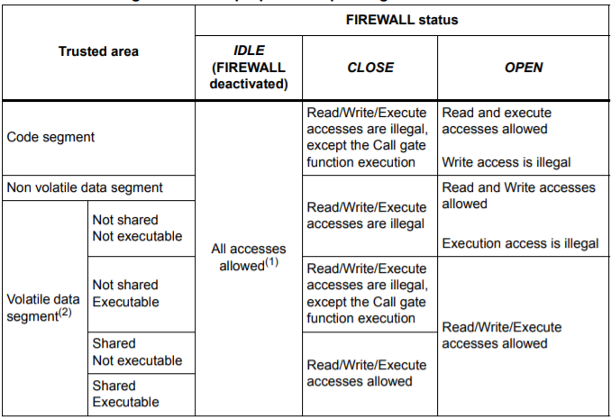
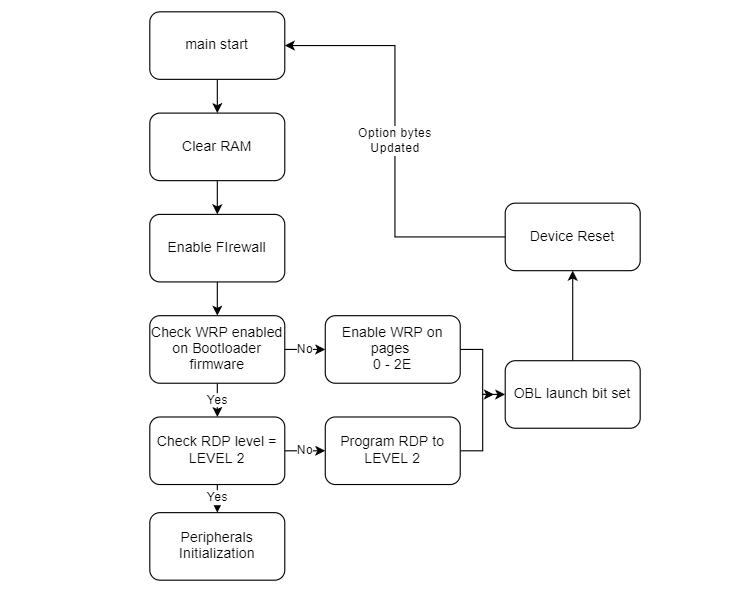

# Bootloader

This Document explains the Bootloader implementation and security features used to prevent various known vulnerabilities.

  

Firmware Upgrade Package
------------------------

### Packet Structure:-

The packet structure implemented for firmware Upgrade is defined by the XMODEM protocol.

*   The XMODEM uses a 128-byte data packet. The packet is prefixed by a simple 3-byte header containing a <SOH\> character, a "block number" from 0-255, and the "inverse" block number—255 minus the block number. The header is followed by the 128 bytes of data, and then a two-byte checksum. The complete packet, thus 133 bytes long, contains 128 bytes of binary file data.

|  SOH  |  Block Number  |  Inverse Block Number  |  Payload Data  |  Payload CRC  |
| ---| ---| ---| ---| --- |
|  1 BYTE  |  1 BYTE  |  1 BYTE  |  128 BYTES  |  2 BYTES  |

  

*   Files are transferred one packet at a time. When received, the packet's checksum is calculated by the receiver and compared to the one received from the sender at the end of the packet. If the two matches, the receiver sends an <ACK\> message back to the sender, which then sends the next packet in the sequence. If there was a problem with the checksum, the receiver instead sends a <NAK\>. If a <NAK\> was received, the sender would re-send the packet, and continue to try several times, normally ten, before aborting the transfer.

  

### Package Structure:-

The DFU package includes 2 header packets and the binary file for an upgrade.

  

| | | |  **Signed DFU Package data Header** (128 bytes) | | | | 
| --- | --- |--- |--- |--- |--- |--- |
| | | |  **DFU package signature Header** (128 bytes) | | | |
| | | |    **Firmware Data** (firmware size)    | | | |
| | | | 

#### Data header packet of 128 bytes contains the following information:-

|  **File Size**  |  **Magic Number**  |  **Firmware Version**  |  **Hardware Version**  |  **Firmware data CRC**  |  **Empty filled with zeros**  |  **Signature on first 64 bytes**   |
| ---| ---| ---| ---| ---| ---| --- |
|  4 bytes  |  4 bytes  |  4 bytes  |  4 bytes  |  4 bytes  |  44 bytes  |  64 bytes  |

  

*   **File Size (4 bytes)**:- If file size exceeds available flash space, Upgrade is aborted
*   **Magic Number (4 bytes)**:- Should be 0x45227A01 for Xmodem else abort
*   **Firmware Version (4 bytes)**:- If the firmware version is lower, the upgrade is aborted
*   **Hardware Version (4 bytes)**:- Should match the current hardware version
*   **Firmware Binary FIle CRC (4 bytes)**:- CRC is matched after the firmware is copied to flash
*   **Signature (64 bytes)**:- Signature generated on a digest of upper 64-byte Header Data

  

#### The signature packet(128 bytes) includes two signatures of 64 bytes each.

*   The signature is ECDSA signature over SECP256R1 curve, calculated on a digest of Firmware binary file.
*   Each Signature generation uses one of four available private keys, corresponding public keys are secured in Bootloader flash.
*   Public keys verify the authenticity of the DFU package after copying the firmware. If signatures are not verified for the firmware written, it is deleted immediately and bootloader resumes waiting for a DFU package with valid signatures.

  

Firewall Protection:-
---------------------

The FIREWALL establishes trusted areas in the memory mapping where code or data are stored and monitors access to these areas. The Firewall allows the Device to manage exactly when the code accesses the trusted areas, and when this secure area goes back to the non-protected code execution. The FIREWALL performs the access monitoring (instruction fetches, read, write operations) and generates a reset if unexpected accesses are detected during the code execution, to stop immediately any intrusive action on the protected areas.

  

  

Firewall can be used to protect: -

*   Code Segment in Flash or RAM
*   Non-Volatile Data Segment in Flash
*   Volatile Data Segment in RAM

  

Firewall has three states,

*   Idle: - Firewall disabled
*   Close: - Firewall Enabled and Protected Segment access would cause a reset
*   Open: - Firewall Enabled and Non - Protected Segment access would cause a reset

  

  

  

As soon as the Firewall is enabled in code, the Pre-defined Segments are protected and the Firewall state is closed. Firewall state changes to Open when Call Gate function is called. Call Gate is code’s entry into the protected area and should be located at the start of Code Segment Address + 4. Access to non-protected code is illegal once the firewall is opened. Firewall state changes to Close as soon as call gate function execution completes.

  

  

Detailed information about the Firewall can be found at this [Application Note](https://www.st.com/resource/en/application_note/dm00209772-using-the-firewall-embedded-in-stm32l0l4l4-series-mcus-for-secure-access-to-sensitive-parts-of-code-and-data-stmicroelectronics.pdf)

  

  

### Code Segment:-

In our implementation Firewall Code Segment is defined in Flash, the code segment contains all functions that will be accessed by the call gate function. Call gate function (secureFunc) performs the following subtasks: -

*   Check and update option bytes for RDP (Read-out Data Protection) which should be level 2.
*   Write Protection on Bootloader Firmware and firewall.
*   Perform Read/Write/Delete at Non-Volatile Data Segment.
*   Read DFU packet Header and Firmware signatures and store in protected Volatile segment.
*   Verify DFU Header signature on header data and verify Firmware Versions stored in protected Non-Volatile Segment
*   Verify Firmware binary signatures with public keys.
*   Verify Flash and OTP region integrity by comparing hash stored at bootdata during firmware upgrade.
*   The code segment can be accessed from firmware for storing secret keys in Firewall Non-Volatile Segment

### Non Volatile Segment:-

Non Volatile Segment is used to store constant data which is critical for secure firmware upgrade and verifies flash integrity. The following data is stored in the Non-Volatile protected segment. This flash section is protected from READ//WRITE via firewall.

Security Checks:-
-----------------

  

Following Security checks have been used:-

*   Read Protection (RDP):- The read protection is activated by setting the RDP option byte and then, by applying a system reset to reload the new RDP option byte. When RDP level 2 is programmed, it prevents data read from flash and disables debugging. Any attempt to read/erase/write from debugger or option bytes will lead to a reset. Bootloader verifies after every bootup if option bytes for RDP is set to level 2 or not. If not, RDP is changed to level 2 again.
*   Application Flash validation:- A sha256 digest of firmware is stored at bootmarker page after a successful firmware update. Flash validation is done at every bootup if the current digest does not match the digest in bootmarker, boot state is changed to misconfigured state and application firmware is erased.
*   Firmware and Hardware version check:- Bootloader does not allow the device to be programmed with a firmware with lower version or a different hardware version. Redundant checks are added for lower firmware versions and is protected from 
*   DFU signature verification:- The firmware binary file is signed twice with two of four available private keys. The public key pairs are stored in protected flash memory, which verifies the DFU package source. If the two signatures are not verified, application space is deleted and Bootloader remains in upgrade mode.

  

Bootloader Modes
----------------

The bootloader has two modes of operation:-

*   Firmware Download Mode
*   Application Boot Mode

  

After MCU has been initialized, bootdata from the Firewall region is checked to detect Bootloader mode(Bootstate).

  

#### Firmware Download Mode

*   Enable USB and Oled
*   Initiate Xmodem sequence, wait for DFU package
*   Parse DFU Package data header, verify header signature and check the firmware version.
*   Parse Signature header init Firmware write sequence.
*   Program(write) incoming packets into Flash.
*   Upon programming the last packet, calculate the SHA256 Hash on complete firmware written.
*   Firmware Binary CRC is also calculated to check for any errors.
*   Verify signatures with Firmware digest and public keys available. If not verified, abort and erase programmed firmware from flash.
*   Update Boot Data with new Firmware Version, firmware size, and change boot state to Upgrade Complete. Auth State and First boot values are set prompting a Device Authentication sequence on Bootup.
*   Calculate and save the SHA256 digest of Application Flash.
*   Reset MCU.

  

#### Application Mode

*   Validate application flash - Calculate Application flash SHA256 and compare with stored digest.
*   If validated, Boot Count is incremented, and the jump function (to application reset handler) is called.
*   If there is a mismatch between the two hashes, the Bootloader state is changed to Misconfigured and firmware is erased.
*   MCU is reset

  

#### Misconfigured State

*   If Bootstate is not Application mode or Firmware Download mode, it is considered as Misconfigured.
*   The misconfigured state could occur due to a failed upgrade or the presence of malicious firmware.
*   User is prompted to Upgrade firmware as the device is misconfigured
*   Rest flow is the same as Firmware Download Mode.

  

### Device Memory Map

This document explains the usage of Volatile and Non-Volatile Memories in Cypherock Wallet X1.

The MCU has Flash Storage of 1Mb, one OTP region of 1Kb and two RAM sections of 128Kb total.

Flash is divided into 2Kb pages with a granularity of 8bytes(word)

| Start Address | Section Size | Description |
| ---| ---| --- |
| 0x08000000 | 36K | Bootloader |
| 0x08009004 | 56K | Firewall Code Area |
| 0x08017000 | 8K | Firewall Data Storage |
| 0x08019000 | 16K | Application User Data |
| 0x0801D000 | 24K | Logger Data |
| 0x08023000 | 884K | Application Firmware |
| 0x20000000 | 96K | Application Firmware RAM |
| 0x10000000 | 32K | Bootloader and Firewall RAM |

  

Firewall Data
-------------

Bootloader, Firewall Code area and Firewall Data Storage are Write protected and write access to Firewall data storage remains with Firewall code are.

Firewall Read directly is restricted when firewall is enabled, so can only be read using Firewall Callgate Function

Firewall data has 4 pages:-

Primary Bootloader Data (0x08017000)

Firmware Version, Firmware state, flash SHA256 digest, etc

Backup Bootloader Data (0x08017800)

To be retrieved if primary page is empty

Permanent Key Storage (0x08018000)

This page is only written once and never erased by application

Secure Data Storage (0x08018800)

This page is used to store data which can be updated