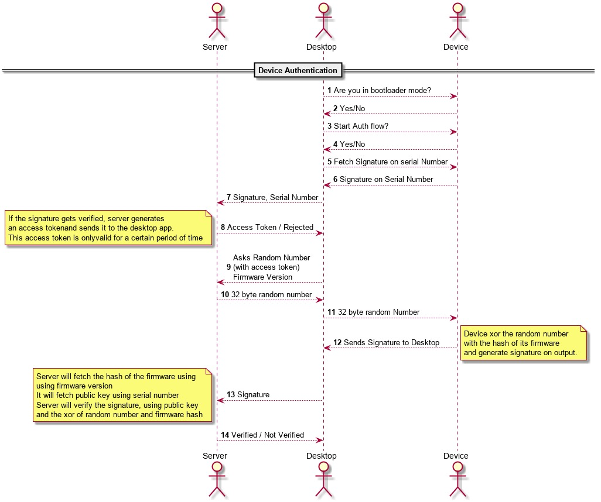

# Device Provision/Auth

Device Auth is a feature of X1 Wallet which uses cryptographic operations between device and server to validate its Authenticity.

Purpose:-
---------

*   Designed to detect any malicious changes in the hardware or firmware of the X1 wallet.
*   Used to detect Supply Chain attacks.

  

Implementation:-
----------------

Before shipping each device is Provisioned with a unique set of private-public keys for device authentication and NFC card pairing. Authentiation is performed by verification of signatures generated by private key in device. Signature verification is performed by server using the corresponding public key.

*   Unique key pairs are generated via a common seed (see key derivation paths [here](#auth-and-nfc-pairing-key-derivation-))

*   The device includes secure chip ATECC608A for storing private keys and sensitive data. ATECC608A and the MCU share an IO\_PROTECTION key which is used to read/write data in encrypted form.

*   After provisioning is complete the sensitive data in ATECC is locked and prohibited for read.

*   **During the provisioning process**, the private keys and NFC pairing keys are stored in device, its public key along with device serial number is stored at server for authentication at later stage.

*   **During the authentication process**, the private key is used to generate signatures on serial number and random data, which is then verified at the server using corresponding public key

*   Change in hardware i.e. the MCU or ATECC during transport to the user can be detected as the shared key won't match.

*   On both MCU and ATECC, the IO\_PROTECTION key is read disabled so cannot be used to create clones.

### Authentication Process:-

The Auth process is designed to detect both Firmware and Hardware changes. Authentication works with the ATECC 608A cryptography chip. Interface with ATECC is done over I2C using the ATECC library. The authentication process takes place in two stages.

#### Device Provisioning:-

Every device is provisioned before shipping using the `device_provision_controller()` function in `device_provision_controller.c`. During Provisioning, a Device serial and Public Key are stored on the server for authentication purposes.

##### Configure ATECC for Provision:-
Device provisioning steps are mentioned below:- 
(For ATECC slot usage check [Table 2](#table-2-atecc-slots-usage))
1.  The ATECC is programmed with the pre-defined config array(see [Table 1](#table-1-atecc-configuration-bytes)).
2.  ATECC config zone and DATA zone are locked
3.  IO\_PROTECTION key is generated with combined RNG(ATECC+STM32) and stored at slot 6 for encrypted write operations. Another copy is stored at the permanent keys page of the Firewall region in MCU.
4.  Device serial number of 32 bytes is defined with Provision Date, MCU ID, Hardware number, and random bytes and stored at slot 8.
5.  Slots 6 and 8 are locked if all operations were performed without error
6.  Send device serial number to Desktop App.

##### Write Derived Private Key:-

1.  CLI tool sends public-private key pair (key derivation given below) and NFC keys for ith device.
2.  The externally generated keys are parsed and verified.
3.  Using the private write command with the IO\_PROTECTION key, the private key is stored at slot 2.
4.  Steps 3 is repeated for slot 3 to save NFC private key
5.  Additional permanent keys related to NFC encryption(card_root_xpub, self_key_id, self_key_path) are stored in the Firewall region.
6.  After all processes are completed successfully, slot 2 and 3 are locked.
7.  All unused slots are also locked after provisioning is complete.

##### Auth and NFC Pairing Key derivation:-

For provisioning all keys are derived from a common source, NIST P256 keys are derived from a common seed, which has different tasks as defined below:-

*   secure NFC communication root key for X1Wallet

m/1000'/1'/2'/0

*   secure NFC communication root key for CyCard

m/1000'/0'/2'/0

*   secure NFC communication key for ith X1Wallet

m/1000'/1'/2'/0/i

*   secure NFC communication key for ith CyCard

m/1000'/0'/2'/0/i

*   Generate wallet ID (sha256 is used)

m/1000'/0'/3'/1

*   Device authentication

m/1000'/1'/0'/0

*   Card authentication key

m/1000'/0'/0'/0

*   Private-public key pair used in signing firmware (prime storage: 4 = local)

m/1000'/4'/1'/0/i

#### Device Authentication:-

Before a device can be used, it must be authenticated using the desktop app at the user end. The authentication process takes place with device\_authentication\_controller() function.

Authenticating a device involves the following tasks as shown in the sequence diagram:-

1.  A signature is generated in ATECC at the SHA256 digest(using GENDIG) of the serial number(slot 8) using the private key(slot 2) and sent to the server along with the serial number.
2.  The server verifies the signature with the public key of the corresponding serial number. If the signature is verified, the server sends a 32-byte Random challenge.
3.  The challenge is XORed with firmware hash(already known to the server) and stored at slot 5 using encrypted write and IO\_PROTECTION key. Encrypted write is performed using the `write` command where the data is encrypted with the IO\_PROTECTION key.
4.  A signature is generated on the SHA256 digest of slot 5 data and sent to the server if verified the Device Authentication process is complete.
5.  At the end of the authentication process, the server notifies the user about the status of the process (successful or failed) on the registered email-id of the user.

All signatures with slot 2 key are generated using the sign command with mode: Internal (0x00). And the data source is digest from gendig in Tempkey.

### Table 1: ATECC configuration bytes

| **Configuration byte Number** | **Name** | **Value** | **Description** |
| ---| ---| ---| --- |
| \[0:3\] | SN\[0:3\] | 0x01, 0x23, 0x00, 0x00 | serial no part1 |
| \[4:7\] | RevNum | 0x00, 0x00, 0x00, 0x00 | Rev number |
| \[8:12\] | SN\[4:8\] | 0x00, 0x00, 0x00, 0x00 | Serial number part 2 |
| \[13\] | AES\_Enable | 0x01 | AES enabled |
| \[14\] | I2C\_Enable | 0x01 | I2C enabled |
| \[15\] | Reserved | 0x00 | reserved |
| \[16\] | I2C\_Address | 0xC0 | Not Changed |
| \[17\] | Reserved | 0x00 | reserved |
| \[18\] | CountMatch | 0x00 | Counter match disabled |
| \[19\] | ChipMode | 0x01 | chipMode |
| \[20:51\] | Slot Config | 0x85, 0x00, 0x82, 0x00, 0x86, 0x46, 0x87, 0x46, 0x85, 0x20, 0x8F, 0x46, 0x8F, 0x0F, 0x9F, 0x8F, 0x0F, 0x0F, 0x8F, 0x0F, 0x0F, 0x8F, 0x0F, 0x8F, 0x0F, 0x8F, 0x0F, 0x0F, 0x0D, 0x1F, 0x0F, 0x0F | Slot config |
| \[52:59\] | Counter\[0\] | 0xFF, 0xFF, 0xFF, 0xFF, 0x00, 0x00, 0x00, 0x00 | monotonic counter 0 not attached to any key |
| \[60:67\] | Counter\[1\] | 0xFF, 0xFF, 0xFF, 0xFF, 0x00, 0x00, 0x00, 0x00 | monotonic counter 1 not attached to any key |
| \[68\] | UseLock | 0x00 | Use lock key disabled |
| \[69\] | VolatileKey Permission | 0x00 | Volatile key permission disabled |
| \[70:71\] | SecureBoot | 0x00,0x00 | Secure boot not used |
| \[72\] | KdflvLoc | 0x00 | kdflvLoc not used |
| \[73:74\] | KdflvStr | 0x69, 0x76 | KdflvStr not used |
| \[75:83\] | Reserved | 0x00, 0x00, 0x00, 0x00, 0x00, 0x00, 0x00, 0x00, 0x00 | reserved |
| \[84\] | UserExtra | 0x00 | User later |
| \[85\] | UserExtraAdd | 0x00 | Not used I2C address |
| \[86\] | LockValue | 0x55 | Data zone unlocked (Converts to 0x00 after provisioning) |
| \[87\] | LockConfig | 0x55 | Config zone unlocked (Converts to 0x00 after provisioning) |
| \[88:89\] | SlotLocked | 0xFF, 0xFF | Slot unlocked (Converts to 0x00, 0x20 after provisioning) |
| \[90:91\] | Chip Options | 0x0E, 0x61 | IO key set to slot 6 IO key enabled ECDH output encryption required  |
| \[92:95\] | X509format | 0x00, 0x00, 0x00, 0x00 | Certificate formatting disabled |
| \[96:127\] | KeyConfig | 0x53, 0x00, 0x53, 0x00, 0x73, 0x00, 0x73, 0x00, 0x73, 0x00, 0x38, 0x00, 0x7C, 0x00, 0x1C, 0x00, 0x3C, 0x00, 0x1A, 0x00, 0x1C, 0x00, 0x10, 0x00, 0x1C, 0x00, 0x30, 0x00, 0x12, 0x00, 0x30, 0x00 | Key Config |

  

### Table 2: ATECC slots usage

|  **ATECC slot**  | **Data Stored** | **Slot Usage** |
| ---| ---| --- |
|  Slot 2  | Authentication Private Key | This key is used to generate signatures using the Internal sign command on the output of Gendig data in tempkey |
|  Slot 3  | NFC pairing Private Key | The key is used to generate signatures for NFC card pairing and shared secrets through ECDH for NFC data encryption. Chip config in config bytes [90:91] ensures output encryption for ECDH command |
|  Slot 5  | Server Challenge XOR MCU Flash hash | This is stored at slot 5 by MCU using encrypted write. |
|  Slot 6  | I/O Protection Key | Used for encrypted write, a copy is stored, in MCU flash during provisioning |
|  Slot 8  | Device Serial Number | The serial number is generated during provisioning and contains 1\. Provision Date 2\. Hardware Version 3\. MCU Unique ID |
