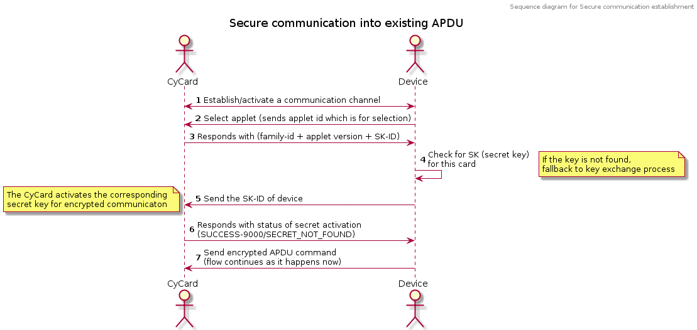

# NFC secure communication

The NFC secure communication is based on a basic source of truth between the device and card. The information for source of truth is derived and verified using ECDSA algorithms. The keys are generated using the HD-Key scheme defined in BIP32. The data for source of truth is infused in secure elements of device and cards. More info about this step can be found under the [in-house device provisioning](#in-house-provisioning) section.

  

The working of secure communication is based upon ECDSA, AES-CBC, AES-CBC-MAC. The entire data that needs to be communicated securely is first encrypted by the AES-CBC algorithm using a _Shared Key_ and an IV generated by the card and a MAC calculation is performed to ensure the integrity of the packet. More information on the working can be viewed under the [working of secure nfc](#working-of-secure-nfc) section.

  

View some [facts and important points](#facts-and-important-points).

   

# In-house provisioning

Legend
------

**PK** - private key

**PUB** - public key

**xPUB** - Extended public key

**md** - master = m/1000'/1'/2'/0

**mc** - child = m/1000'/0'/2'/0

**_Mc-xPUB_** - Master Extended public key for cards

**_Md-xPUB_** - Master Extended public key for devices

**_Mc-PK_** - Master private key for cards

**_Md-PK_** - Master private key for devices

**_Cc-PK_** - Child private key for nth card (**_m/1’/n’_**) derived from **_Mc-PK_**

**_Cd-PK_** - Child private key for nth device (**_m/1’/n’_**) derived from **_Md-PK_**

**SK** - Shared key

**SKID** - Session key identifier = first four bytes of _sha256(SK)_

  

Provisioning Setup
------------------

BIP32/39 generates public-private key pairs. A PUB-PK pair is generated for each device and card separately using **_Md-PK, Mc-PK_** of device and card respectively. **_Md-PK_** for devices is used to generate **_Cd-PK_**s for each device and similarly, **_Mc-PK_** for cards is used to generate **_Md-PK_**s for each card. **_Mc-xPUB_** for cards is stored in each device. **_Md-PUB_** for the devices is stored in each card.

  

The **_Cd-PK_** of the device is stored in a secure region on the permanent storage.

This is a replacement of digital signatures wherein, we are creating an ECDSA-based key pair using the HD-key derivation process. This ECDSA key pair is what determines the authenticity of parties during the Diffie-Hellman key exchange process.

#### Card provision:

The Java provisioning client has **_Mc-PK and Md-xPUB_**. It then performs non-hardened derivation for the path **_mc/j/i_** (where j = n/(2^31) and i = n%(2^31) for nth card being provisioned by this java provisioning client) and infuses the private key along with devices' root xpub into the card.

  

**_Mc-PK_**      ------(provisioning client does non-hardened derivation for **_mc/j/i_**)------>   **_Cc-PK_**

Now, the **_Cc-PK and Md-xPUB_** _are infused into the card_ along with the derivation path **_j/i_**_._

  

#### Device provision:

The cli provisioning tool has **_Mc-xPUB and Md-PK_****.** The cli performs hardened derivation for the **_md/j/i_** (where j = n/(2^31) and i = n%(2^31) nth device being provisioned by the cli tool) and transfers the two private keys to the device.

  

**_Md-PK_**      ------(provisioning tool does non-hardened derivation for **_ms/j/i_**)------>   **_Cd-PK_**

Now, the **_Cd-PK and Mc-xPUB_** _are infused into the atecc chip_ along with the derivation path **_j/i_**_._

_Steps no 11 and 12 have been added as a result of new changes._

One-time Authentication b/w a Device & a Card
---------------------------------------------

In the first communication, there is an authenticated diffie hellman key exchange done b/w the cards and the device \[[https://www.researchgate.net/figure/Diffie-Hellman-key-exchange-for-authentication\_fig1\_329141054](https://www.researchgate.net/figure/Diffie-Hellman-key-exchange-for-authentication_fig1_329141054)\].

When the message needs to be sent from device to card, the _device signs it using the_ **_Cd-PK_** of the device (signature is generated inside ATECC) and then sends it with the derivation path. The card on receiving the message derives the **_Cd-PUB_** from the stored **Md-xPUB** (device) & the derivation path. The card then uses the **_Cd-PUB_** to verify the message digest (signature). Similarly, the device on receiving the message derives the **_Cc-PUB_** from the stored **Mc-xPUB** (card) & the derivation path. The device then uses the **_Cc-PUB_** to verify the message digest (signature).

  

When the communication ends on a success note, on both the ends (device and card), in the end there is a secret key shared between authenticated entities. The _shared key_ (**_SK_**) is generated in real time after the Diffie-Hellman and stored in both device and card. This key is used for encryption/decryption of the message b/w device & cards.

LRU \[Least recently used\] Queue in Card
-----------------------------------------

The queue will implement a **_mapping of the SKID and the associated SK_** with a proposed queue size of 5 entries.

Card maintains an LRU queue to store the C-PUB/Derivation path in a queue. Every time a card interacts with a new device, it checks for space in the LRU queue. If there is no space, it removes the LRU element from the queue. In the case of third party software wallets(Android/IOS app communicating directly with the cards), we can use an open key for encrypted communication \[TBD\].

  

Lost/New device auth
--------------------

This will require a mechanism to determine if the two entities has pre-established _shared key (_**_SK_**_)_. If the keys are not synced between the two entities, the authentication process is to be initiated from the device’s end.

Integration into existing flow of NFC communication
---------------------------------------------------

Every secure APDU can use its original (existing) data format and is simply wrapped with an encryption, decryption steps on the source and destination of the data.

  

#### \[New\] DH-SK sharing / Pairing

The DH key sharing is triggered by the X1Wallet device using this APDU. This won’t check for existing SK for the device at hand. So the particular APDU can be used to either create a new SK for _unknown devices_ or refresh the SK for the pair of device and card.

Command APDU

|  TAG  |  Value  |
| ---| --- |
|  CLA  |  ‘00’  |
|  INS  |  ‘12’  |
|  P1  |  ‘00’  |
|  P2  |  ‘00’  |
|  LC  |  ‘xx’  |
|  DATA  |  Key ID (0xYY)  |  ‘4’  |  4 bytes of key-id of the device  |
|  DH-component (0xYY)  |  ‘32’  |  The device’s DH component  |
|  Derivation path (0xYY)  |  ‘8’  |  Derivation path of the device which invoked the APDU  |
|  Signature (0xYY)  |  ‘70/71/72’  |  The device’s PK signature on (device key-id ||DH-component || derivation path) data  |

  

_Response APDU_

|  TAG  |  Length  |  Data  |
| ---| ---| --- |
|  Key ID (0xYY)  |  ‘4’  |  4 bytes of key-id of the device  |
|  DH-component (0xYY)  |  ‘32’  |  The cards’s DH component  |
|  Derivation path (0xYY)  |  ‘8’  |  Derivation path of the card’s public key  |
|  Signature (0xYY)  |  ‘70/71/72’  |  The card’s PK signature on (card key-id ||DH-component || derivation path) data  |

  

_Status Words_

|  SW  |  Meaning  |
| ---| --- |
|  ‘9000’  |  OK  |
|  ‘9C00’  |  Signature verification failed  |
|  ‘6A80’  |  Wrong Data  |

   

# Working of Secure NFC

#### PAIRING

*   The device fetches its information:
    *   Self key-id
    *   Randomly generated nonce
    *   Self key-id path
    *   Self private key
*   The device hashes (sha256) the following information (in order):
    *   Self key-id
    *   Randomly generated nonce
    *   Self key-id path
*   The device generates a signature on the generated hash
*   The prepared data for pairing is sent to the device

Data format: **_<Device key-id> <Device random nonce> <Device key-id path> <Device signature on the data>_**

*   The card verifies the data length (raises wrong length exception otherwise)
*   The card finds a slot for pairing (always succeeds)
*   The card fetches the **_device-key-id-path_** and derives the device’s public key from the **_root-device-node_**
*   The card verified the signature (raises an exception on failure)
*   The card generates the following information:
    *   ECDH signature (common for device and card)
    *   Random nonce
*   The card performs a hashing operation (sha256) on following data (in order):
    *   ecdh(s,s)
    *   Random card nonce
    *   Random device nonce
*   The card stores the generated data in its keystore with the device-key-id as entry
*   The device generates a signature on the data
*   The device send the data along with its signature
*   The device fetches the card’s public key from the **_card-root-xpub_** 
*   The device hashes the data received from the card
*   The device verifies the signature on the hash with the generated **_card-public-key_** 
*   The device generates the **_Shared Key_** and stores it with the **_card-key-id_** as entry

  

##### Maths involved

*   Uses nistp256 / secp256r1 EC curve
*   Uses ECDH for key sharing (**_Pairing Key_**)
*   **Pairing Key = sha256( ecdh(s, s) || card nonce || device nonce )**

  

#### DATA EXCHANGE

*   The device performs applet selection.
*   Card responds with following information:
    1.  Applet version (appended with commit hash)
    2.  Family-ID
    3.  Card’s Key-ID
    4.  16-byte random data (used as IV for data exchange)
*   Device checks for an entry with **_card-key-id_**. If an entry exists, then card proceeds with exchanging data, encrypting with the **_Pairing Key_** and appending it’s own Key-ID at the end of the data.
*   Card extracts the **_device-key-id_** from the packet and checks for an entry with **_device-key-id_**. If an entry exists, then the card responds with encrypted data (if any). In case an entry is not found, the card responds with an exception indicating the same.
*   If the device does not find an entry for the received **_card-key-id_**, it prompts the user and gives an option to go for pairing.
*   If the device receives an exception of (Non-existent pairing key), the device again, prompts the user to and gives an option to go for pairing.

##### Maths involved

*   Uses AES-CBC encryption with AES-CBC-MAC for message authentication and integrity check.
*   Uses ISO/IEC\_9797-1 Padding method 2 for AES-CBC encryption
*   Uses ISO/IEC\_9797-1#MAC\_algorithm\_1 for CBC-MAC
*   Uses 16-byte random data as IV for AES-CBC encryption
    *   The IV for very first packet in a particular session is generated by card and thereon, the MAC of previous packet is used as IV for the subsequent packets.

List of data with encryption
----------------------------

*   Data payload (excluding key-id (in case of device) and status word (in case of card)) is always encrypted
*   Add wallet, delete wallet, fetch list of wallets, recover wallet, AES encryption, AES decryption, wallet challenge fetch, wallet challenge verification, & fetch debug data

List of data w/o encryption
---------------------------

*   Data exchange in “select applet” is always unencrypted
*   APDU headers are unencrypted
*   Status word of card is always unencrypted
*   Key-id (of either entities) is always unencrypted
*   Private key derivation path is always unencrypted
*   The random component (of card and device) is transmitted unencrypted

   

# Facts and Important points

Pairing happens for every pair of card and device separately. This results into following points:

1.  Every device-card pair will need to be paired to perform certain actions that do data exchange
2.  The cards belonging to the same family are considered to be different cards and have their own individual information that uniquely identifies and verifies each card separately
3.  Every new device / card will have following information
    1.  Card will have _chain code + uncompressed public key_ of the _device’s root node_
    2.  Device will have _xpub of the card’s root_ node
    3.  Cards will have their own unique private key derived from Card’s root node. Example: the path for HD Key of a card can be **_<card-root-node>/0/0_**
    4.  Devices will have their own unique private key derived from Device’s root node. Example: the path for HD Key of a device can be **_<device-root-node>/0/0_**
    5.  Each will have an identifier of their own derived from the hash of their respective private key
    6.  Once a device and card are paired with each other, they both will store the **_Shared Key_** in their respective permanent memory. The entry is made in the following format: **_<usage-count>:<key-id (device/card)>:<shared-key>_**

Usage count of ‘0’ means the entry is empty. The card will make an entry for a device’s key-id while a device will make and entry with a card’s key-id. The shared-key data is common for both and is the main secret for the encrypted communication.

1.  The device/card never share the following information on the NFC:
    1.  Their respective private keys
    2.  Their respective public keys
    3.  The common pairing key
2.  The device/card share the following information for pairing:
    1.  Their respective key-id
    2.  Their respective nonces (randomly generated for each new pairing operation)
    3.  Their respective HD Key path. Example: If, for a device, the path of its pvt-key is **_<device-root-node>/0/0_** , then it’s path is **_‘0/0’_** and share’s this information as 4+4 byte data **_(0x00000000/0x00000000)_** 
    4.  Signature on the pairing data (generated with their respective private keys)
3.  In further communication, the device and card exchange their key-id (which helps each make a selection of the common **_Pairing Key_** from their respective keystore) appended to the original data packet. The key-id goes unencrypted with every packet.
