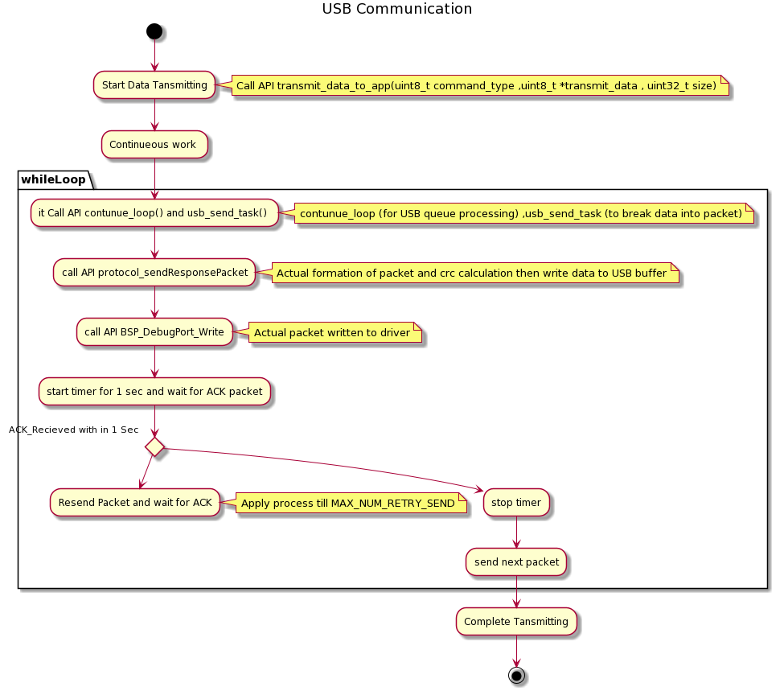
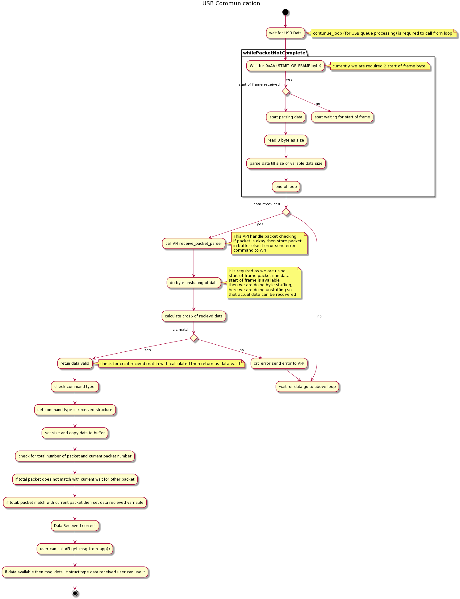
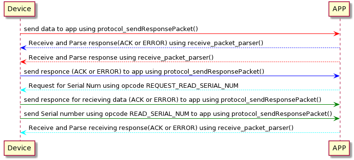

# USB Communication

  

Packet Structure
================

  
|  Start of Frame (0x5A5A)  |  Opcode (Command Type)  |  Payload Size  |  Current Packet Num  |  Total Packet Num  |  Data   |  CRC 16  |
| ---| ---| ---| --- | --- | --- | --- |
|  2 Byte  |  4 Byte  (Big-endian)  |  1 Byte  |  2 Byte  (Big-endian)  |  2 Byte  (Big-endian)  |  As per size (index 2)  |  2 Byte (Big-endian)  |

Packet header indicates the start of a packet, command, and size of data.

When the data size is more than 32 bytes, it is broken into multiple packets. Data Header tells the number of packets for that command and the current packet number.

Command Type description
========================

|  Command Name  |  Value   (hex / decimal)  |  Sent by  |  Data  |
| ---| ---| ---| --- |
| _ACK_ | 01H/ 1 | Both | \- |
| _NACK_ | 07H/ 7 | Both | \- |
| Start Card Auth | 46H / 70 | Desktop | Start Card Authentication |
| Send Card Auth Signature to App | 0D / 13 | Device | \- |
| Card Auth Random Num | 10H / 16 | Desktop | Random Number to sign from desktop |
| Card Auth Signed Challenge | 11H / 17 | Device | Signed Challenge |
| App Log Data Request | 25H / 37 | Desktop | Request for device log |
| App Log Data Send | 26H / 38 | Device | Send Device Log Packet |
| _Ready or not_ | 29H / 41 | Desktop | Padding 1 byte (0x00) |
| _Status Command_   | 2AH / 42 | both | 00 - Failure 01 - Success 02 - Ready (Yes! Device is ready) 03 - Not Ready(No! Device is not ready) 04 - Abort (sent by desktop when users abort the flow in between)  |
| _Start Add Wallet_ | 2BH / 43 | Desktop | Padding 1 byte (0x00) |
| _Wallet Details_ | 2CH / 44 | Device | 16 byte Wallet Name \+ 1 byte of is password set \+ 32 byte of Wallet ID |
| _Send Wallet ID and Selected coin indexes_ | 2DH / 45 | Desktop | 32 byte Wallet ID + 1 byte (00 - add coin / 01 - resync coin) + Number of coins \* 4 bytes |
| _Coins confirmation in Add Coin_ | 2EH / 46 | Device | 00 - Not Ok 01 - Ok |
| _Pin entered_ | 2FH / 47 | Device | 00 - Wrong pin entered 3 times and wallet locked 01 - Correct pin entered |
| _Cards tapped_ | 30H / 48 | Device | Padding 1 byte (0x00) |
| _XPubs_ | 31H / 49 | Device | Number of coins x ( 82 byte xpub ) |
| _Meta data for send transaction_ | 32H / 50 | Desktop | WalletID + MetaData + fees |
| _Coin confirmed in send txn_ | 33H / 51 | Device | 1 byte (01- yes / 00 - no) + 2 bytes (transaction size limit) |
| _Unsigned Txn_ | 34H / 52 | Desktop | Unsigned txn ( size may vary ) |
| _Recipient and amount verified on device_ | 35H / 53 | Device | 01-yes 00-address not verified 02-amount not verified 03-fee not verified |
| _Signed txn_ | 36H / 54 | Device | Signed txn ( size may vary ) |
| _Receive Transaction Start_ | 3BH / 59 | Desktop | WalletId (32 bytes) + receive address path (20 bytes) |
| _Coins confirmed in rec txn flow_ | 3FH / 63 | Device | 00 - no 01 - yes |
| _Address verified by user on device_ | 40H / 64 | Device | 00 - no 01 - yes |
| _Xpub (for given coin index) found on device_ | 41H / 65 | Device | 00 - no 01 - yes |
| _Wallet is Locked_ | 4BH / 75 | Device | Padding 1 byte (0x00) |
| _No wallet found on device / No wallet with this Id found on device_ | 4CH / 76 | Device | Padding 1 byte (0x00) |
| _Start Firmware Upgrade_ | 4DH / 77 | Desktop | Firmware Version (4 bytes) |
| _User Firmware Upgrade Choice_ | 4EH / 78 | Device | Confirm - 01 Reject - 00 |
| _User Reject Pin Input_ | 4FH / 79 | Device | Confirm - 01 Reject - 00 |
| _Wallet does not exist on card_ | 51H / 81 | Device | Error message to desktop when wallet not found on the card. |
| _Start Device Provision_ | 54H / 84 | Desktop | 01 - Start Provisioning, with 4bytes Provision Date 02 - External Provisioning Keys, see provisioning document for External Keys and provisioning steps 03 - Failed Provision |
| _ADD DEVICE PROVISION_ | 52H / 82 | Device | Send Device Serial Number |
| _CONFIRM PROVISION_ | 50H / 80 | Device | Confirm - 01 Reject - 00  Confirm means all external keys have been saved successfully |
| _Start Device Authentication_ | 53H / 83 | Desktop | 01 - Sign Serial Number command 02 - Sign Challenge command with 32-byte challenge |
| _Device Serial number signed_ | 55H / 85 | Device | Return Postfix1 (7 bytes) + Postfix2 (22 bytes) + signature (64 bytes) + Return serial number (32 bytes) |
| _Device challenge signed_ | 56H / 86 | Device | Return Postfix1 (7 bytes) + Postfix2 (22 bytes) + signature (64 bytes) |
| _Device info_ | 57H / 87  | both | Desktop - Padding 1 byte (0x00) Device - 1 byte (device auth state) + 32 byte (device id) + Firmware version (4 bytes) |
| _USER CONFIRMED PASSPHRASE_ | 5AH / 90 | Device | Padding 1 byte (0x00) |
| _USER REJECTED PASSPHRASE INPUT_ | 5BH / 91 | Device | Padding 1 byte (0x00) |
|  |  |  |  |

  

USB Communication Protocol
==========================

The device is configured as Communication Device Class (CDC). CDC is used to create a serial COM port on PC, for data communication with desktop apps. The desktop app recognizes the Device through USB device descriptors PID(product ID) and VID(Vendor ID).

USB Transmit
============

USB Receive
===========

  

  

Sequence Diagram-
=================

