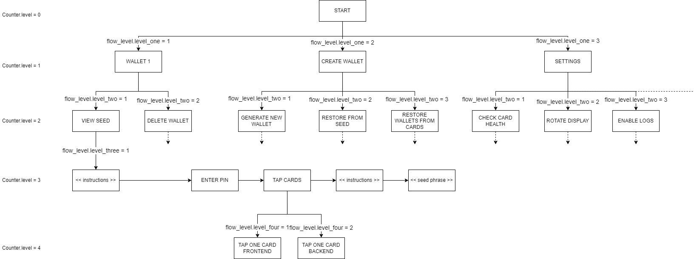

# Flows
Flows, in the scope of this application, can be defined as the sequence of operations executed to perform a particular task. This may be as simple as showing a message on screen or signing a transaction.

## Flow Levels 
The entire UI of the application is divided into various flow-levels. There are total of 4 levels of flow that the device transitions in and out of. UI of the application can be visualized as a tree structure with a start node as the root and the different states of the application making up the nodes each level. Each node in any level can further branch into multi child nodes thereby creating the nodes of the next level.

The operations at each level have been distinctly separated. The flows are:
 * Level one
 * Level two
 * Level three
   * Add wallet
   * Old wallet
   * Advanced settings
 * Level four
   * Core
   * Card tap

The state of device is managed mostly by two crucial struct variables namely **flow_level**, **counter**. These structures are defined in `controller_main.h`.

The `flow_level` signifies the case at each level that should be followed to reach the current operational state of the device. Graphically it determines which branch should be followed to reach a particular node. It also stores any error states and corresponding error message. Apart from that it also stores any triggers initiated by the desktop application and the corresponding message to be displayed to the user. The `counter` stores the current level at which the device is operating. In other words, the `counter` structure stores the depth at which the user currently is during any flow in UI tree and the `flow_level` stores the branch of the node in the UI tree.

> `counter` structure controls the vertical flow of the UI and the `flow_level` structures controls the horizontal flow of the UI. Both of which are updated in various controllers for each level.

### Tasks and Controllers
The other major functional component of the entire architecture are the concept of tasks and controllers functions. Each task at all the levels have their own task and controller pair specific to that flow.

#### Tasks
These functions handle the user interaction, screen rendering, timeout_handlers, etc. The user actions directly trigger events which is received and processed by these functions. These functions basically respond to user actions and render any response to that event.

#### Controllers
The controllers handle background processing and the post processing of the events triggered by the user actions. These actions can include triggering communication via USB/NFC, heavy processing of key generation, encryption, etc. These functions are basically the post-event triggers that do the necessary background processing upon a user action. An important function of the controllers is to update the value of `counter` structure and `flow_level` structure which are checked to determine which task should be performed by the application.

> Some of the controllers have a `_b` suffix in their name. These controllers are back controllers that are called when a user presses the back button. Contrary to the other controllers, these controllers decrement the `counter` level and `flow_level` to bring the application to its previous state.

### Flow level one
This is the base level at which the application displays Main menu on the device screen. The main task of this level is to populate the available wallets on the device and prepend them to the Main menu.

This level also handles displaying of various error screens. Any communication triggers from the desktop app are also handled at this level.

If the current operational level of the device is higher that this level then the just higher (second) level tasks/controllers are called.

### Flow level two
This level displays the sub-menus for each main menu choice. Upon user selection, the controller bumps the currents operational level of the device.

If the current operational level of the device is higher that this level then the just higher (third) level tasks/controllers are called.

### Flow level three
This level initiates the major device operations such as Adding wallet, Deleting wallet, Viewing data, etc. All the local features that demand heavy processing happened at this level.

If the current operational level of the device is higher that this level then the just higher (fourth) level tasks/controllers are called. This level does most of the heavy processing and calls the fourth level only for the purpose of NFC communication to send/fetch data from cards.

### Flow level four
This level holds most of the features of the device. It handles all the desktop triggered flows, as well as all the NFC communication flows are processed at this level. At this stage, this is the last level of operation of this application. At this level the heaviest and crucial operations of the device take place such as signing transactions, generating public addresses, exporting wallets, wallet verification, etc.

## Event Loop
An event loop is defined in the `main.c` file which performs various operations such as calling the task handlers, calling the controllers and refreshing the screen etc. Whenever a user performs any action, the event loop calls the level one controller to update the values in `counter` and `flow_level` structures or to show error messages. If the UI is already on level one, then the level one controller will further call level two controller. This continues until we reach the the last controller which matches the level at which we are. Once all required controllers are called, the event loop then calls the level one tasks. Tasks of a particular level get executed based on the value stored in the structures `counter` and `flow_level`. Like the controllers, tasks also call the child tasks if the controller level is greater than that of the current task.

As an example consider the following View Seed flow:

### View Seed Flow

*The red arrows in the above diagram denote the path taken for View Seed Flow*

1. Initially the user is presented with the Main Menu when the `counter.level` is `1` and `flow_level.level_one` is `1`.
2. Suppose the user selects the first wallet. This triggers the series of controllers which update the `counter` and `flow_level` values and the corresponding tasks display second level menu with  `counter.level` set to `2` and `flow_level.level_two` as `1`.
3. Similarly, the user then selects View Seed and moves to the third level and with `counter.level` set to `3` and `flow_level.level_three` set to `1`.
4. The View Dummy Seed state is non visible to user since it only assigns the next flow level in case wallet pin has not be set. The controllers called at the end of this state update the structures and the proceed to the next horizontal flow level with `counter.level` as `3` and `flow_level.level_three` as `2`.
5. If the pin is set then the user enters the pin and the application will move the next state in the flow by setting `counter.level` to `3` and `flow_level.level_three` to `3`.
6. During this state the tasks prompt the user to tap the cards. The card authentication is handled separately in different counter level. So the corresponding controllers increment the `counter.level` to `4`.
7. At fourth counter level, there are `4` flow levels. First, showing the screen with message to tap the first card, then processing the card tap in the backend and these steps are done again for the second card.
8. On successful authentication, the `counter.level` is decremented to `3` and `flow_level.level_three` is incremented to `4` and the user is shown the Successful Recovery screen.
9. After recovery, the `flow_level.level_three` is incremented to `5` and the user is finally shown the Seed.
